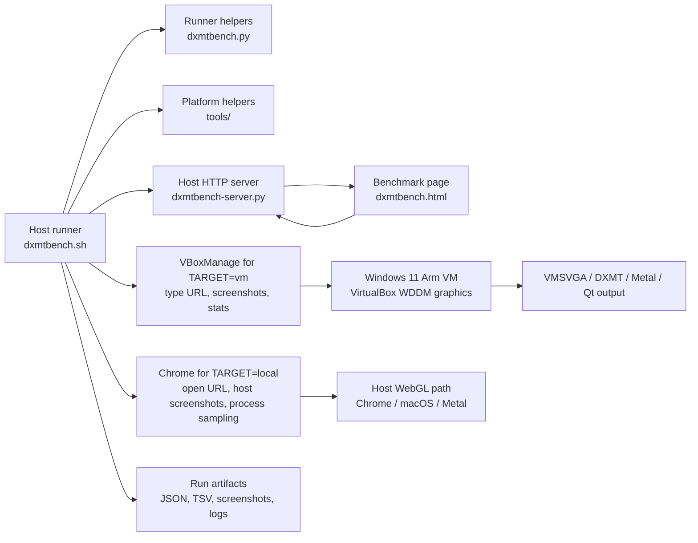

# DXMTBench WebGL Throughput Benchmark

This benchmark exists to give us a repeatable way to exercise the Windows-on-macOS/Arm
VirtualBox graphics path while we work on HiDPI, repaint, VMSVGA, DXMT, and Metal
throughput issues.

It is intentionally small, self-contained, and host-driven. The guest only needs a
browser that can open a URL served by the host. The host starts the benchmark page,
collects browser events and final results, samples the VirtualBox process, captures
screenshots, and writes artifacts that are easy to compare between patched builds.

The same page and suite runner can also run against a local host browser. That gives
us a reference path for the browser/WebGL workload on the Mac itself, without the
VirtualBox guest, WDDM, VMSVGA, DXMT, and Qt output layers.

## Why This Exists

The benchmark came out of the VirtualBox 7.2 macOS/Arm graphics investigation. We
first measured desktop responsiveness using window open/close workloads and active
CPU in the host `VirtualBoxVM` process. That was useful for GUI repaint and output
update work, but it was not enough for GPU-path development:

- simple desktop workloads are often dominated by Qt repaint behavior, guest window
  manager behavior, and vsync-limited presentation;
- many easy WebGL scenes sit at roughly 60 FPS, which hides differences in shader,
  vertex, render-target, upload, stencil, and state-change throughput;
- native D3D tooling inside a Windows Arm guest would add setup friction and make
  each test run slower;
- failures we saw, including gray or black guest output after stress runs, needed a
  harness that records browser events, host logs, screenshots, and VirtualBox state
  around the run.

The browser/WebGL path is a pragmatic middle layer. It drives the same guest graphics
stack that ordinary accelerated Windows apps use:

```text
VM target:
  WebGL2 in guest browser
    -> ANGLE
    -> Direct3D 11 in the Windows guest
    -> VirtualBox Graphics Adapter (WDDM)
    -> VMSVGA / VirtualBox 3D device model
    -> DXMT translation on macOS
    -> Metal / Apple GPU driver
    -> VirtualBox Qt display output

Local target:
  WebGL2 in host Chrome
    -> host browser graphics stack
    -> macOS graphics stack
    -> Metal / Apple GPU driver
```

This is not a pure native Direct3D benchmark and it is not a direct Metal benchmark.
That is deliberate. We want a reproducible workload that crosses the same layers that
matter for Windows desktop usability in this VM.

## Base Architecture

The benchmark has three parts.



### `dxmtbench.html`

The HTML file is the benchmark payload. It contains the WebGL2 workloads, HUD, result
collection, and event reporting. It runs entirely in the guest browser and posts
intermediate events plus the final result back to the host server.

The page reports:

- FPS and frame-time statistics;
- canvas size, device pixel ratio, and estimated pixel volume;
- draw calls, vertices, render-target work, state changes, and stencil work where
  applicable;
- estimated throughput in pixels/s and MB/s;
- GL vendor, renderer, version, extensions, and timer-query availability;
- runtime status and errors.

The HUD is intentionally visible and fairly rich. When the VM output freezes or goes
blank, the visible HUD state and the posted event stream help distinguish browser,
guest-driver, VirtualBox device, and host-output failures.

### `dxmtbench-server.py`

The Python server runs on the host. It serves the benchmark page and receives:

- `POST /event` for intermediate state changes and progress notifications;
- `POST /result` for the final benchmark result.

For VM runs, the runner writes the full browser configuration to `bench-config.json`
and the server injects it into the served HTML. The URL typed into the guest stays
short on purpose; long query strings were observed to be truncated by VirtualBox
keyboard injection before the final parameters reached the browser.

The VM normally reaches the host through VirtualBox NAT at `10.0.2.2`. Local browser
runs use `127.0.0.1`. Both modes use the same server and the same browser-side result
format.

### `dxmtbench.sh`

The shell runner is the orchestration layer. It starts the server, opens the benchmark
URL, waits for progress and completion, samples host-side process statistics, captures
screenshots, and writes one run directory per invocation. Python-heavy work such as
JSON event emission, suite result aggregation, crash-report parsing, browser-result
formatting, and screenshot visual analysis lives in `dxmtbench.py`; the shell script
only calls those helper subcommands.

The runner keeps platform-specific host integration in separate helper files. Today
`tools/macos-window-id.swift` contains the macOS `CGWindowList` lookup used to capture
Chrome and VirtualBoxVM windows by window id. On non-macOS hosts this lookup is
skipped, while the core browser/server/result path remains usable for local browser
comparisons and future Linux or Windows host adapters.

With `TARGET=vm`, the runner uses `VBoxManage` to open the URL in the guest, capture
VM screenshots, gather selected VM state, collect VMSVGA statistics, and scan the VM
log for known graphics-alert patterns.

VM browser navigation defaults to launching the configured browser explicitly through
the Windows Run dialog, with a disposable profile and the recorded guest browser
flags. The runner first opens a blank isolated window, waits for Edge to own keyboard
focus, and then types the exact run URL into its address bar. That avoids Windows Run
parsing URL query separators and avoids depending on an older focused Edge tab. The
older address-bar reuse path is still available with `LAUNCH_METHOD=browser` for
manual debugging.

With `TARGET=local`, the runner opens the URL in local Chrome and skips the VM-only
probes. By default it launches Chrome with a disposable `--user-data-dir` inside the
run artifact directory and closes that process tree after the run. This avoids
contaminating screenshots with the user's existing tabs and keeps CPU sampling scoped
to the benchmark browser. Set `LOCAL_BROWSER_ISOLATED=0 CLEANUP_BROWSER=0` to reuse
the normal Chrome session during manual debugging. Local screenshots are captured from
the current benchmark window, not from the whole desktop, so the local target is also
useful as a visual correctness gate.

For suites, the runner executes several workloads and writes aggregate TSV/JSONL files
so we can compare patched and baseline builds with minimal manual work.

VM suites default to one persistent host HTTP server and one stable port for the whole
suite. Each workload still gets its own output directory; the server routes `/event`
and `/result` posts by `runId` and rejects stale page requests whose run id no longer
matches the current workload configuration. This avoids interpreting a guest
networking or repeated-navigation failure as a rendering result. Explicit-profile VM
runs terminate and remove the isolated browser after screenshots are captured, so
later workloads do not inherit its processes or memory; the captured mid-run image
remains the durable visual evidence.

## Workload Families

The benchmark includes light, medium, and deliberately heavy workloads. Easy workloads
are useful as smoke tests, but the heavy workloads are the ones most likely to expose
real throughput differences because they should fall below the display refresh cap on
the current stack.

Current workload classes:

- `clear`: minimal frame loop and presentation overhead.
- `fill-basic`: simple full-canvas fill workload.
- `vortex-shader`: fragment-shader heavy procedural workload.
- `texture-sampling`: texture bandwidth and sampling workload.
- `cubes-instanced`: instanced geometry workload.
- `cubes-fill`: geometry plus higher fill pressure.
- `vertex-vortex`: vertex transform pressure.
- `dynamic-buffer`: dynamic buffer update and upload pressure.
- `rtt-postprocess`: render-to-texture plus postprocessing pass.
- `gl-cubes-heavy`: heavier instanced cube scene.
- `shader-vortex-heavy`: intentionally expensive fragment shader workload.
- `vertex-vortex-heavy`: high vertex-count transform workload.
- `stencil-maze-heavy`: stencil and depth interaction workload.
- `d3d11-state-heavy`: WebGL/ANGLE proxy for D3D11-style state churn.

The `d3d11-state-heavy` name is descriptive rather than literal. The benchmark does
not call D3D11 directly. It creates WebGL state transitions that ANGLE lowers into
D3D11 work inside the Windows guest.

## Running The Benchmark

Run from the repository root.

```bash
./dxmtbench.sh
```

Useful examples:

```bash
# One quick smoke suite.
SUITE=smoke ./dxmtbench.sh

# One quick local Chrome smoke suite.
TARGET=local SUITE=smoke ./dxmtbench.sh

# Default comparative suite.
SUITE=default ./dxmtbench.sh

# Default local Chrome comparative suite.
TARGET=local SUITE=default ./dxmtbench.sh

# Heavy low-FPS scenes. These are opt-in.
ALLOW_HEAVY=1 SUITE=heavy ./dxmtbench.sh

# Everything currently defined.
ALLOW_HEAVY=1 SUITE=all ./dxmtbench.sh

# Print a compact suite table after completion.
SUITE_PRINT=table SUITE=default ./dxmtbench.sh

# Compare a run against an earlier suite result.
BASELINE=/path/to/suite-results.jsonl SUITE=default ./dxmtbench.sh
```

The default VM name is expected to be `Win11`. Override it with:

```bash
VM="Win11" ./dxmtbench.sh
```

The runner uses `VBoxManage`. If needed:

```bash
VBOXMANAGE=/path/to/VBoxManage ./dxmtbench.sh
```

When testing a patched VirtualBox build, point `VBOXMANAGE` at that build's
`VBoxManage`. If you also have the matching source checkout available, set
`VIRTUALBOX_SRC=/path/to/virtualbox` so the run artifacts record the tested source
commit.

## Important Environment Variables

Common controls:

- `TARGET`: `vm` for the VirtualBox guest path, or `local` for the host browser path.
- `VM`: VirtualBox VM name.
- `WORKLOAD`: single workload name.
- `SUITE`: workload suite name, such as `smoke`, `default`, `heavy`, or `all`.
- `DURATION`: measured runtime in seconds.
- `WARMUP`: warmup time before measurement.
- `START_DELAY_MS`: browser-side delay before WebGL setup starts. It defaults to three
  seconds for VM automation so the runner can launch and resize/fullscreen the guest
  browser before warmup, and to zero for local runs.
- `DPR`: device pixel ratio override, or `auto`.
- `MAX_CANVAS_PIXELS`: canvas pixel cap. This defaults to a safer capped value.
  Raise it for explicit 4K or Retina throughput runs; for example,
  `MAX_CANVAS_PIXELS=12000000` allows a 3840x2160-class render target.
- `EXPECTED_CANVAS_WIDTH` and `EXPECTED_CANVAS_HEIGHT`: optional minimum backing-store
  dimensions. Use these for resolution/fullscreen matrices; a result below either
  requested dimension is a functional failure rather than comparable performance data.
  VM runs with `BROWSER_FULLSCREEN=1` require both values to be positive so an
  accidentally small or resized guest cannot be accepted as fullscreen evidence.
- `OUTROOT`: parent directory for benchmark artifacts.
- `BASELINE`: previous `suite-results.jsonl` used for comparisons.
- `VIRTUALBOX_SRC`: optional VirtualBox source checkout used only to record the tested
  source commit in `host-info.txt`.
- `MIDRUN_SCREENSHOT`: defaults to `1`; captures a screenshot during the measurement
  phase as `measure-mid.png`.
- `MIDRUN_SCREENSHOT_DELAY`: optional delay in seconds before `measure-mid.png`. The
  default is zero: capture starts as soon as the browser posts `measure-start`. On
  macOS, the window lookup helper is compiled before browser launch so helper startup
  time cannot push short-run screenshots past context release. For VM runs the
  user-visible host window is captured synchronously before requesting the guest PNG;
  this prevents `VBoxManage screenshotpng` from holding the display path until after
  the browser has released its final frame.
- `RELEASE_CONTEXT`: controls whether the page releases WebGL resources after it posts
  its result. When mid-run capture is enabled, the default is `0`: the measured final
  scene remains visible until the runner finishes host and guest captures and closes
  its isolated browser. This makes short Retina runs reliable even when PNG capture
  completes after the timed measurement. With `MIDRUN_SCREENSHOT=0`, the default is
  `1`; either default can be overridden explicitly.
- `VISUAL_ANALYSIS`: defaults to `1`; classifies screenshots as blank black, blank
  white, blank gray, achromatic, low contrast, or varied output.
- `HOST_WINDOW_SCREENSHOT`: defaults to `1` for VM runs; captures the actual macOS
  VirtualBoxVM window in addition to the guest framebuffer. This catches host
  presentation failures that `VBoxManage screenshotpng` cannot see. The current
  implementation uses `tools/macos-window-id.swift` and `screencapture`, so this
  specific host-window capture path is macOS-only.
- `FOCUS_SCREENSHOT_WINDOW`: defaults to `1` for VM host-window screenshots. The
  runner brings the VirtualBox window forward before capturing it so `screencapture`
  does not read a stale background-window backing store.
- `LAUNCH_METHOD`: defaults to `run` for VM runs. This launches `GUEST_BROWSER_EXE`
  with its disposable profile and flags through the Windows Run dialog, waits for the
  new window, then navigates through its address bar. This avoids both unknown
  default-browser state and Windows Run truncation of query-bearing URLs.
  Set `LAUNCH_METHOD=browser` to reuse the active browser tab during manual debugging.
- `GUEST_BROWSER_STARTUP_SECONDS`: seconds to wait for the new isolated guest browser
  window before focusing its address bar; defaults to `5`.
- `GUEST_BROWSER_PROFILE`: optional guest profile path. When omitted, the runner owns
  a run-specific `%TEMP%\\dxmtbench-*` profile and removes it during cleanup. A
  caller-supplied profile is never removed by the runner.
- `GUEST_BROWSER_MAXIMIZE`: defaults to `1` for VM runs. After opening the benchmark
  URL, the runner sends a normal Windows maximize gesture to the active browser window
  so high-resolution guest modes actually enlarge the WebGL render target. This is
  separate from browser fullscreen.
- `BROWSER_FULLSCREEN`: defaults to `0`. Fullscreen toggling is opt-in because it can
  make repeated automated suite runs harder to correlate with the visible tab. When
  enabled for a VM run, positive `EXPECTED_CANVAS_WIDTH` and
  `EXPECTED_CANVAS_HEIGHT` values are mandatory.
- `CLEANUP_BROWSER`: defaults to `1` for explicit-profile VM launches and isolated
  local Chrome runs, and to `0` for address-bar reuse or a normal local Chrome session.
  VM cleanup terminates `GUEST_BROWSER_PROCESS` and removes the disposable profile.
- `GUEST_KILL_BROWSER_BEFORE_RUN`: defaults to `1` for explicit-profile VM launches,
  preventing an older Edge tree from contaminating the first or next measurement.
- `GUEST_BROWSER_PROCESS`: process image terminated by isolated VM cleanup; defaults
  to `msedge.exe`.
- `SUITE_PERSISTENT_SERVER`: defaults to `1` for VM suites; one host server and one
  port are reused for all workloads while per-run events are still routed into the
  correct workload directory.
- `SUITE_INTER_RUN_DELAY`: defaults to `3` seconds for VM suites and `0` for local
  suites. The delay leaves a short visible pause after each workload and reduces
  repeated-navigation churn in the guest browser.
- `SUITE_RESET_VM_BETWEEN_RUNS`: defaults to `0`. Set to `1` when comparing branches
  that make the guest browser, NAT path, or VirtualBox display output unstable across
  repeated automated navigations. The runner resets the VM and waits for Guest
  Additions before every workload, which is slower but gives isolated visual evidence
  per workload.
- `SUITE_RESET_SETTLE_SECONDS`: defaults to `5`; extra wait after reset isolation sees
  Guest Additions and a real `10.0.2.x` NAT lease.

Workload intensity controls:

- `SHADER_ITERS`: fragment shader loop pressure.
- `VERTICES`: vertex workload size.
- `DYNAMIC_VERTICES`: dynamic-buffer workload size.
- `TEXTURE_SIZE`: texture workload size.
- `OFFSCREEN_SCALE`: render-target scaling for postprocess work.
- `PASSES`: repeated draw/pass count for selected workloads.
- `SYNC_EVERY`: optional synchronization cadence.

Safety controls:

- `ALLOW_HEAVY=1`: permits the explicitly heavy low-FPS suite.
- `ALLOW_HAZARDOUS=1`: permits known-dangerous combinations such as uncapped Retina,
  burst mode, explicit finish loops, or very large stress settings.
- `FAIL_ON_GRAPHICS_ALERT=1`: makes the runner fail if known graphics-alert patterns
  appear in collected logs.
- `FAIL_ON_ALERT`: defaults to `1`, so a suite exits nonzero when any workload has a
  functional, transport, graphics, or configured baseline-regression alert. Set it to
  `0` only when intentionally collecting a failing diagnostic matrix.

Local browser controls:

- `LOCAL_BROWSER`: local browser selector. The default is `chrome`.
- `LOCAL_BROWSER_APP`: macOS application name used by `open`; default is
  `Google Chrome`.
- `LOCAL_BROWSER_WIDTH` and `LOCAL_BROWSER_HEIGHT`: requested local Chrome window
  size.
- `LOCAL_BROWSER_ISOLATED`: defaults to `1`; launches Chrome with a disposable
  run-local user-data directory. Set to `0` to navigate the active tab in the normal
  Chrome session.
- `LOCAL_BROWSER_PROCESS_PATTERN`: process pattern used for local CPU sampling;
  default is `Google Chrome`.
- `CLEANUP_BROWSER`: defaults to `1` for isolated local Chrome and `0` for the normal
  Chrome session.

## Heavy Versus Hazardous

Heavy workloads are intended to be slow enough to measure. They still run through a
normal `requestAnimationFrame` loop and keep the default canvas pixel cap unless you
override it.

Hazardous settings are different. They can put unusual pressure on the guest and host
graphics stack and have previously helped reproduce failures such as Metal allocation
errors, DXMT argument heap problems, and blank or stale VirtualBox output. Examples:

- `MODE=burst`;
- `FINISH=1`;
- `DPR=auto MAX_CANVAS_PIXELS=0` on a full Retina display;
- very high `PASSES`, `SHADER_ITERS`, `TEXTURE_SIZE`, or buffer sizes.

Use hazardous settings only when trying to reproduce or isolate a failure. They are
not appropriate for routine baseline comparisons.

## Output Artifacts

Each run writes a timestamped directory under `dxmtbench-runs`.

Important files:

- `run-config.txt`: effective runner configuration.
- `bench-config.json`: browser-side benchmark configuration injected by the host
  server. The page also reports `configSource`, `rawQuery`, and injected config keys
  in browser events so stale navigation or URL truncation is visible.
- `host-info.txt`: host and VirtualBox version context.
- `browser-events.jsonl`: progress, warnings, and lifecycle events posted by the page.
- `browser-result.json`: final browser-side benchmark result.
- `functional-validation.txt`: the final functional gate decision and reason codes.
  A run exits nonzero if this file reports `failed`.
- `summary.txt`: compact human-readable run summary.
- `active.cpu`: sampled active CPU for the host `VirtualBoxVM` process.
- `VirtualBoxVM.sample.txt`: macOS process sample when available.
- `before.png`, `measure-mid.png`, and `after.png`: guest framebuffer screenshots
  before, during, and after the run. `measure-mid.png` is the most useful guest-side
  check for whether the workload actively rendered, because some tests intentionally
  release the WebGL context after measurement.
- `host-before.png`, `host-measure-mid.png`, and `host-after.png`: macOS window
  captures of the VirtualBoxVM output window for VM runs. These are the files to
  inspect when checking that the user-visible window is not blank, stale, gray, or
  otherwise different from the guest framebuffer. These files are produced only when
  the macOS window-id helper and `screencapture` path are available.
- `visual-summary.txt` and `visual-summary.json`: screenshot classifications. The
  classifier ignores the top-left HUD area where possible so a visible overlay does not
  hide a blank white, black, or gray rendering surface. The `visual_primary_*` lines
  identify the screenshot that should be used for pass/fail checks. For VM runs this
  prefers the host VirtualBox window capture, because accelerated output may not be
  represented in `VBoxManage screenshotpng`.
- `framebufferProbe` inside `browser-result.json`: a post-measurement WebGL readback
  sampled across the default framebuffer. It records color-bin variation, chromatic
  samples, checksum, context state, and GL errors without adding probe time to FPS.
- `vminfo-before.txt` and `vminfo-after.txt`: selected VM state snapshots.
- `vmsvga-stats.xml`: VMSVGA statistics when available.
- `graphics-alerts.log`: matched graphics-alert lines from logs.
- `graphics-alerts-summary.txt`: compact alert summary.

For `TARGET=local`, VM-specific files such as `vminfo-before.txt`,
`vmsvga-stats.xml`, and `graphics-alerts-summary.txt` are intentionally absent. Local
runs instead include `local-browser.stdout`, `local-browser.stderr`, optional
`local-browser.pid`, and `local-browser.sample.txt`.

Suite runs also write aggregate artifacts:

- `suite-summary.tsv`: one row per workload.
- `suite-results.jsonl`: final JSON result per workload.
- `suite-events.jsonl`: combined event stream.
- `suite-alerts.jsonl`: per-workload alert state.
- `suite-latest.json`: latest suite metadata.
- `suite-status.txt`: suite pass/fail summary.

These files are designed so an agent or script can consume only the small JSONL/TSV
summaries during development, while detailed logs and screenshots remain available
when a run regresses.

The TSV row is written only after functional and graphics-alert validation completes.
Its `baseline_eligible` field is true only for an alert-free `ok` result with a valid
browser framebuffer proof and the current run's varied visual signature. Baseline
loading rejects older rows that do not carry this functional evidence.

## Visual Correctness Gate

Every workload is expected to show graphical output while it is running. A completed
JSON result without visible output is not enough evidence for VirtualBox graphics
work.

Before blaming a VirtualBox branch, run the same workload locally in Chrome:

```bash
TARGET=local ALLOW_HEAVY=1 SUITE=all ./dxmtbench.sh
```

For a healthy benchmark, each workload must satisfy both independent gates:

1. `browser-result.json` contains `framebufferProbe.ok=true`, proving that the WebGL
   default framebuffer was nonuniform, chromatic, context-intact, and free of GL
   errors at the end of measurement.
2. `visual-summary.txt` contains
   `visual_primary_measure_mid=visible-varied ... signature=present`, proving that the
   current scene reached the actual browser/VirtualBox presentation path during the
   measurement window.

The DOM signature proves screenshot freshness only; it never excuses blank,
achromatic, or otherwise invalid scene pixels. An unexpected WebGL context loss is a
terminal functional failure. If a workload fails the local Chrome gates, fix the
benchmark first. If it passes locally but the VM run is black, white, gray, stale, or
missing the expected scene in the primary VM screenshot, investigate the VirtualBox
guest, device, DXMT, or host presentation path for that branch.

Visual classification normalizes embedded screenshot color profiles to sRGB. The
freshness signature is checked in both that normalized image and the PNG's encoded RGB
values, because macOS display-profile conversion can clip saturated CSS colors even
though the captured pixels preserve them exactly. Either representation must still
contain all four run-specific cells as similarly sized, ordered rectangles in the
expected bottom-right geometry. Merely finding similar colors elsewhere in a stale
scene does not satisfy freshness.

VM runs can also fail before the benchmark page starts. Those are not graphics
throughput results. The suite reports these separately as transport/page-load alerts,
for example `transport-no-script-start` when Edge navigates to `10.0.2.2` but the host
server sees no `GET`. In that case, inspect the screenshot and `http-server.log`
before comparing FPS or visual output. For long VM comparisons, prefer a fixed suite
port such as `SUITE_PORT=53337` and split very long suites if Edge or the VirtualBox
NAT path becomes unstable after repeated automated navigations.

The mid-run screenshot is the primary visual signal. Some workloads release or idle
their WebGL context after measurement, so `after.png` is useful but should not replace
`measure-mid.png` when deciding whether a benchmark actually rendered during the
measured interval.

The visual classifier crops away the HUD and surrounding browser/window chrome before
classifying the screenshot. This is intentionally strict: a readable HUD, address bar,
Windows taskbar, or stale browser tab is not enough to pass the visual gate.
`VISUAL_ANALYSIS=0` skips only this presentation screenshot gate; the browser-side
framebuffer probe, browser result, and positive-frame validation remain mandatory.

## Measurement Model

The benchmark reports several kinds of numbers. They should not be interpreted as
hardware counters.

- FPS is measured from the browser frame loop after warmup.
- Frame percentiles are computed from browser-side frame timings.
- Pixel, vertex, draw, state-change, framebuffer-bind, and stencil counts are
  estimated from the known workload structure.
- MB/s throughput is derived from those estimates and assumed byte widths.
- Host CPU is sampled from the macOS `VirtualBoxVM` process.
- In local mode, host CPU is sampled from processes matching
  `LOCAL_BROWSER_PROCESS_PATTERN`.
- GPU timer data is reported only if the browser exposes usable WebGL timer queries.

The MB/s figures are useful for comparing the same workload across VirtualBox builds
and settings. They are not a replacement for native GPU counters.

Local Chrome results are useful as a host-side reference and as a sanity check for the
benchmark itself. They should not be treated as the target performance number for the
VM. They bypass the Windows guest, VirtualBox WDDM driver, VMSVGA device model, DXMT
translation path, and Qt output path.

## Known Limitations

The benchmark includes browser and ANGLE behavior by design. That makes it relevant to
real Windows guest applications that use the accelerated browser and D3D11 stack, but
it also means the result is not a clean measurement of one isolated VirtualBox layer.

Known limits:

- easy workloads are often vsync-limited near 60 FPS;
- browser scheduling and power policy can influence frame cadence;
- WebGL timer queries may be unavailable, disabled, or not useful through ANGLE;
- guest resolution, Windows scaling, and macOS Retina backing size materially affect
  fill-rate and output-copy costs;
- a black, gray, or stale VirtualBox window can indicate host display-output failure
  even when the guest browser is still posting events;
- this does not directly test WDDM 2.x, DX12, DXIL, descriptor heaps, residency,
  paging, preemption, or full modern D3D12 semantics.

For our current work, those limitations are acceptable because the purpose is to
compare VirtualBox changes that affect the practical Windows-on-macOS/Arm desktop
graphics path.

## Why Host-Driven Instead Of Guest-Installed Tools

The host-driven design keeps test iteration fast:

- no guest compiler or SDK is needed;
- changing the benchmark is just changing the served HTML or runner;
- the host can collect artifacts even if the guest display becomes unusable;
- the same run script can start the VM, open the browser, capture screenshots, sample
  CPU, and compare results;
- results remain outside the guest, so crashes or forced VM resets do not lose the
  important evidence.

This is also why the page posts intermediate events. If the UI output freezes, the
event stream tells us whether JavaScript is still running, whether the browser reached
completion, and where the visible output diverged from guest-side progress.

## Adding A New Workload

To add a workload:

1. Add a workload factory in `dxmtbench.html`.
2. Return a frame function and an `estimate()` function.
3. Register the workload in `workloadFactories`.
4. Add it to a suite in `dxmtbench.sh` if it should run automatically.
5. Add a guard if the workload is heavy or hazardous.
6. Keep estimated counters aligned with the fields consumed by the runner.

After editing, run:

```bash
awk '/<script>/{flag=1;next}/<\/script>/{flag=0}flag' \
  dxmtbench.html > /tmp/dxmtbench-check.js
node --check /tmp/dxmtbench-check.js
bash -n dxmtbench.sh
```

For a new heavy workload, also verify that `SUITE=heavy` refuses to run unless
`ALLOW_HEAVY=1` is set.

## Practical Baseline Workflow

A useful development cycle is:

1. Boot the patched VM once and let Windows settle.
2. Run `SUITE=smoke` to confirm the harness and guest browser still work.
3. Run `SUITE=default` for routine comparisons.
4. Run `ALLOW_HEAVY=1 SUITE=heavy` when investigating throughput-sensitive changes.
5. Compare against a known-good `suite-results.jsonl`.
6. Inspect `graphics-alerts-summary.txt`, `measure-mid.png`, `host-measure-mid.png`,
   `visual-summary.txt`, and `browser-events.jsonl` before trusting a run that
   produced surprising numbers.

For a host-browser reference run:

```bash
TARGET=local SUITE=default SUITE_PRINT=table ./dxmtbench.sh
```

Use the local results to answer two questions: whether the workload itself behaves
sensibly on the Mac, and how far the VirtualBox path is from the host browser path for
the same WebGL workload.

If the guest output turns black, gray, stale, or stops updating, keep the run directory.
Those artifacts are part of the evidence, not disposable noise.
